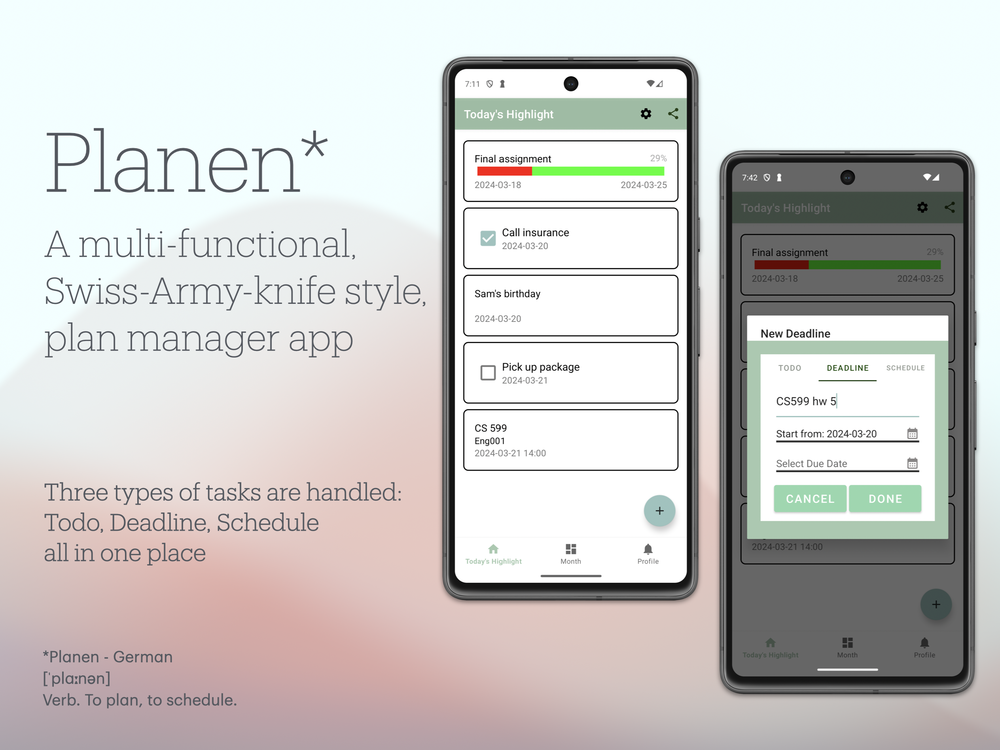
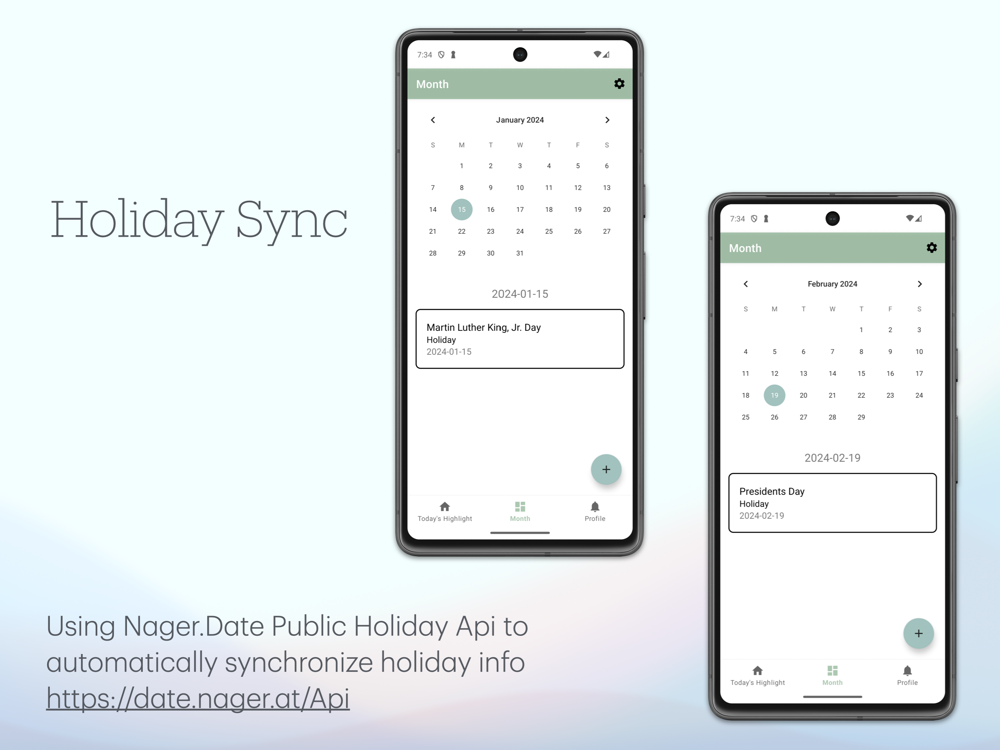
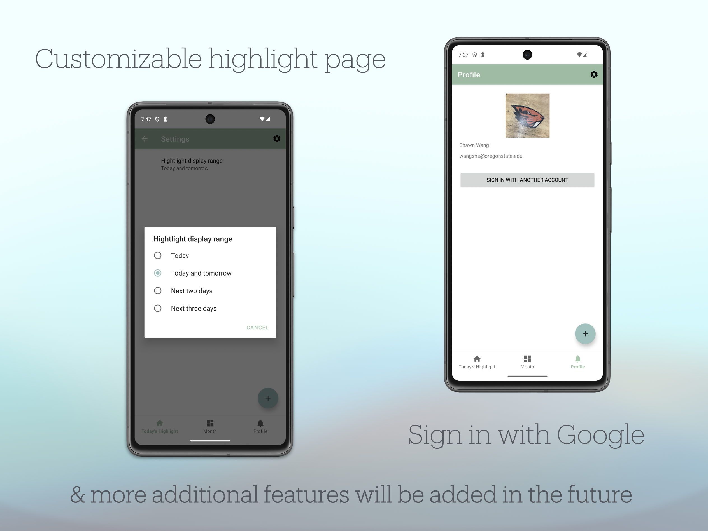

# Planen

A multi-functional, Swiss-Army-knife style, plan manager app developed with Kotlin native android environment.

Planen covers three major kinds of plan types: to-do, deadline, and schedule all in one place.

> Planen - German\
> [ˈplaːnən]\
> _Verb._ To plan, to schedule.

# Table of Contents
- [Posters](#posters)
- [Feature Lists](#feature-lists)
- [Future features/todos](#future-featurestodos)

## Posters

## Feature Lists

- Take three kinds of task type
- Deadline type can show progress according to the position of today between start day and the due day
  - Dynamic deadline progress reflecting user's day of choosing in month view: only on branch `deadline`
- Data are all saved in a local database
- Using Nager public holiday API to load into America Holiday when the app started
- Month view allows users to go to different days in the past or the future
- Today’s highlight allows users to see today’s tasks or a preferred range from today. -- preference page
- Swipe to delete tasks, double confirm, and then it will be removed from the database as well
- Allow user to share their today’s highlights, be about to launch another app, eg. message, to share
- Google sign-in, load into user’s profile picture, username, email address

## Future features/todos

[Full future features checklist](https://github.com/shawn120/Planen-Android/issues/1)

First priority:
- Clean codes
- Fix month view display bug. The refreshing error will jump to the last cached day
- Try to make the TaskItem back to "type nesting" instead of "type overlapping"
